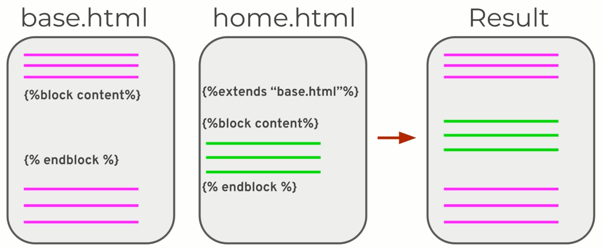

# შაბლონების გამოყენება + [Jinja](#jinja)
_[Templates](https://flask.palletsprojects.com/en/1.1.x/tutorial/templates/#templates)_ ანუ შაბლონები წარმოადგენენ სტატიკურ ინფორმაციას და გამოყოფილ ადგილებს (placeholders) დინამიური ინფორმაციისათვის.

## შესავალი
ამ ეტაპაბამდე ვნახეთ როგორ შეიძლება წინასწარ გაწერილი სტატიკური HTML კოდის ბრაუზერში გამოჩენა python-ის ბიბლიოთეკა Flask-ის გამოყენებით.
რეალურად html გვერდის გამოსაჩენად უნდა დავუკავშირდეთ view ფუნქციას, რომ შევძლოთ წინასწარ გამზადებულ HTML შაბლონთან მუშაობა.
ამ რიგად ჩვენ შევძლებთ სტატიკური გვერდის შაბლონში დინამიურად ინფორმაციის მიმოცვლას მომხმარებელსა და სერვერს შორის.

Flask-ი გაშვებისას ავტომატურად იპოვის HTML ფაილებს განთავსებულს _**/templates** დირექტორიაში_

## სარჩევი
- [შესავალი](#შესავალი)
- [/static - ბინა სტატიკური ფაილებისთვის](#/static)
- [``render_template()`` - შაბლონის რენდერი](#შაბლონის-რენდერი)
  - [``render_template()`` გამოყენების მაგალითი / მინიმალური კოდი](#render_template-გამოყენების-მაგალითი)
- [Jinja](#jinja) 
  - [სადემონსტრაციო მაგალითი](#jinja-ს-გამოყენების-მაგალითი)
  - [ენის სტრუქტურა და ანატომია](#ენის-ანატომია)
  - [control structures - ლოგიკის მართვა](#control-structure)
    - [if](#if)
    - [macros](#macros)
- [Template Inheritance](#template-inheritance)
- [``url_for()`` და help ფუნქციები](#url_for()_დამხმარე_ფუნქციები)
- [ფორმები](#ფორმები)
## /static
როგორც შევთანხმდით დინამიური ვებ აპლიკაციის შემადგენელ ელემენტებში სედის სტატიკური რესურსებიც. სტატიკურ რესურსებად შეგვიძლი განვიხილოთ
ვებ აპლიკაციის მუშაობაში ჩართული ყველა ის ელემენტი რომელიც მუშაობის პროცესში არ იცვლება, მაგალითად: ვებ გვერდის შემადგენელი სურათები, სტილური ფაილი, ჯავასკრიპტ კოდი და ა.შ.
სწორად გამართული ვებ სერვერი ავტომატურად პოულობს ამ ფაილებს და იყენებს როგორც სტატიკურ რესურსებს, თუმცა დეველოპმენტ პროცესშ ამ საფეხურის გავლა ხელით შეგვიძლია.
ამისთვის უბრალოდ უნდა შექმნა დირექტორია /static სადაც შეძლებ იმ სტატიკური ფაილების მოთავსებას რომლის პროექტში გამოყენებასაც გეგმავ.

სტატიკური ფაილების მისამართის დასაგენერირებლად შეგიძლია გამოიყენო [url_for](#url_for()_დამხმარე_ფუნქციები) ფუნქცია:

````python
url_for('static', filename='style.css')
````

ეს მაგალითი დააგენერეირებს მისამართს static/style.css ფაილისთვის.


  
## [შაბლონის რენდერი](https://flask.palletsprojects.com/en/1.1.x/quickstart/#rendering-templates)
წინა თავში გარჩეული მეთოდის გამოყენებით HTML-ის python-ის კოდიდან დარენდერება არც პრაქტიკული მეთოდია, რადგან html სინტაქსთან მორგება საკმაოდ დამღლელი პროცედურა იქნება და არც კოდის მხრივ ვიზუალურად მისაღები.
სტატიკური html ფაილის რენდერის საუკეთესო გზა არის flask-იდან render_template მეთოდის გამოყენება და .html ფაილის view ფუნქციიდან გამოტანა.

გვერდის გამოსაჩენად კი მხოლოდ html შაბლონის დასახელების/მისამართის და საჭიროების შემთხვევასი ცვლადების მნიშვნელობის მითითება იქნება საჭირო:

### render_template გამოყენების მაგალითი
```python
from flask import render_template

@app.route('/about')
def about():
    return render_template('about.html',)
``` 

Flask-ი ავტომატურად იპოვის templates დირექტორიაში არსებულ about.html ფაილს და დაგვიბრუნებს გვერდის რენდერს შესაბამის მარშუტზე მოთხოვნის გაგზავნისას.


## [Jinja](https://jinja.palletsprojects.com/en/2.11.x/)
შაბლონთან სამუშაო ენა


Flask-ი შაბლონებში დინამიური ელემენტების ჩასატვირთად იყენებს [Jinja](https://jinja.palletsprojects.com/en/2.11.x/) -ს ბიბლიოთეკას.
ის თანამედროვე, მარტივად გამოსაყენებელი შაბლონთან სამუშაო ენაა, შექმნილი [Djano-ს შაბლონების](https://docs.djangoproject.com/en/3.1/topics/templates/#:~:text=A%20Django%20template%20is%20a,is%20rendered%20with%20a%20context.) პრინციპზე.
მისი სისწრაფის და უსაფრთხოების გამო ის აქტიურად გამოიყენება ფლასკზე აწყობილ ვებ სერვისებში.

ჯინჯას დახმარებით ჩვენ შევძლებთ პითონიდან შაბლონს გადავცეთ სტრინგები, სიები, ლექსიკონები და სხვადასხვა ტიპის მონაცემები წინასწარ გამზადებულ შაბლონებს.


### ენის ანატომია
როგორც შევთანხმდით შაბლონური ენები შეიცავენ კოდის სტატიკურ ანუ უცვლელ და დინამიურ ანუ ცვლად ელემენტებს. ცვლადი ელემენტი შეიძლება იყოს
როგორც ცვლადი ასევე პროგრამული ლოგიკა რომელის მუშაობითაც შექმნილი მნიშვნელობა ჩნდება შაბლონში შესაბამისი ფლეისჰოლდერის ნაცვლად.
სინტაქსურად jinja იყენებს ორ ძირითად აღნიშვნას ცვლადები/ლოგიკისთვის და მნიშვნელობის გამოსატანად. ეს აღნიშვნები კოდში გამოიყენება როგორც თეგები, დელიმიტერები.

თეგი/დელიმიტერი | აღწერა
--- | ---
[``](https://jinja.palletsprojects.com/en/2.11.x/templates/#list-of-control-structures) | გამოიყენება პირობის ან ლოგიკის გასაწერად (მაგალითად ლუპების)
[`{{ ... }}`](https://jinja.palletsprojects.com/en/2.11.x/templates/#expressions) | გამოიყენება მნიშვნელობის შაბლონში გამოყოფილ ადგილას გამოსატანად.
[`{# ... #}`](https://jinja.palletsprojects.com/en/2.11.x/templates/#comments) | გამოიყენება ფაილში კომენტარის დასამატებლად რომელიც არ გამოჩნდება რენდერისას

> შეჯამება: Jinja-ს შაბლონი .html ფორმატის ფაილი რომელიც ვებ გვერდის შაბლონში დინამიური ელემენტების განთავსებაში გვეთხმარება.
> შეთანხმების თანახმად, flask-ის პროექტისთვის jinjaს ფაილები თავსდება /templates დირექტორიაში.
> მისი მუშაობის პრინციპი წააგავს სტრინგ ფორმატინგით მუშაობას, თუმცა შაბლონური ენები დამატებით შესაძლებლობას გვაძლევს HTML ფაილში პროგრამის ლოგიკის დატანის..

### Jinja-ს გამოყენების მაგალითი
[ავაწყოთ ჯინჯას ფაილი](https://jinja.palletsprojects.com/en/2.11.x/templates/) html-ის დახმარებით და დავაკავშიროთ flask აპლიკაციასთან

#### Python-ს მხარეს
ფლასკში ჯინჯას ფაილის რენდერი

````python
from flask import render_template

@app.route('/hello/<name>')
def hello(name):
    return render_template('hello.html', name=name, my_list = ["ელემენტი 1", "ელემენტი 2", "ელემენტი 3"])
````

#### Jinja-ს მხარეს
ჯინჯას დახმარებით აწყობილი hello.html ფაილი
```jinja2
<!doctype html>
<title>შაბლონური Jinja-ს ფაილი</title>

  <h1>მოგესალმები {{ name }}!</h1>

  <h1>გამარჯობა მომხმარებელო!</h1>

<ul>
    
        <li>{{n}}</li>
    
</ul>
```

შესაბამისად render_template ფუნქციისათვის გადაცემული პარამეტრები ხდება გამოყენებადი ჯინჯას შაბლონში, როგორც პროგრამული ლოგიკის ასაწყობად ისე მონაცემთა შაბლონში გამოსაჩენად.

### [Control Structures](https://jinja.palletsprojects.com/en/2.11.x/templates/#list-of-control-structures)
Control Structures ეწოდება კოდის იმ ელემენტს რომელიც პროგრამის შესრულების ლოგიკის დინებას მართავს. Pythonდან უკვე ვიცით რამოდენიმე მსგავსი ელემენტი
მაგალითად if/elif/else პირობები, for და while ლუპები. ჯინჯასთან მუშაობისას ძირითადად გამოვიყენებთ ორ ძირითად სტრუქტურას: [if-statements](https://jinja.palletsprojects.com/en/2.11.x/templates/#if) და [for-loops](https://jinja.palletsprojects.com/en/2.11.x/templates/#for).

მიუხედავად იმისა რომ სინტაქსით jinja წააგავს python-ს, გაითვალისწინეთ რომ კოდის ბლოკის საზღვრები ყოველთვის უნდა გაწეროთ, პირობის ან ლუპის დასასრულს, ბლოკის ბოლოს შესაბამისი თეგით 

#### if
მაგალითად: 

````jinja2

  <h1>ჭეშმარიტი პირობა!</h1>

  <h1>მცდარი პირობა!</h1>

````

#### macros
მაკრო შეგვიძლია წარმოვიდგინოთ როგორც ელემენტი "ფუნცქია" პროგრამირების ენებიდან. მაკროში შეგვიძლია მოვათვსოთ განმეორებადი კოდის ფრაგმენტი
და გამოვიყენოთ გვერდის აწყობისას. მაგალითად ერთი სტრუქტურის ელემენტი, რომელიც რამდენჯერმე გვინდა გამოჩნდეს ჩვენს გვერდზე გარკვეული პირობების გათვალისწინებით
შეიძლება გაიწეროს მაკროში და მოხდეს მისი რამდენჯერმე გამოყენება. 

_თუ მაკრო აღწერილია სხვა ფაილში, აუცილებელია მისი პროექტში შემოტანა [import](https://jinja.palletsprojects.com/en/2.11.x/templates/#import)-ის გამოყენებით._


## [Template Inheritance](https://jinja.palletsprojects.com/en/2.11.x/templates/#template-inheritance)
Jinja-ს ერთ-ერთი უძლიერესი მხარეა შაბლონის template inheritance. შაბლონის ინჰერენტულობა გვაძლევს შესაძლებლობას შევქმნათ საბაზისო ჩონჩხური შაბლონი რომელიც თავის თავში მოიცავს ვებ გვერდის ასაშენელად განკუთვნილ ყველა ბლოკს და შემდგომ ჩავაშენოთ კონკრეტული ელემენტები ვებ გვერდში.



ვებგვერდების აწყობისას შეამჩნევთ რომ საიტზე განთავსებული გვერდები იზიარებენ მსგავს ელემენტებს. მაგალითად, როგორც წესი, ნავიგაციის პანელი ყველა გვერდისთვის საერთოა, ისევე როგორც ფუტერი. 
იმისთვის რომ ერთი და იგივე ელემენტების გაწერა რამდენჯერმე არ დაგვჭირდეს შაბლონის შექმნისას, გამოვიყენებთ ჯინჯას შაბლონის ინჰერენტულობის მეთოდს.

ამისთვის ჯერ შევქმნით საბაზისო ფაილს basic.html რომელიც შეიცავს საიტის რამდენჯერმე გამოყენებად ელემენტებს, ხოლო შემდგომ მას გამოვიყენებთ კონკრეტულ გვერდზე ჩასაშენებლად `` და `` სინტაქსის გამოყენებით.

### base.html საბაზისო შაბლონი
საბაზისო შაბლონში ავაწყობთ გვერდის ძირითად განლაგებას და გავწერთ თუ სად უნდა მოთავსდეს უშუალოდ ჩატვირთული გვერდის კონტენიტ:

````jinja2
<div class="container">
      <h2>საბაზისო შაბლონის ნაწილი</h2>
      <br>
      
      <br>
      <h2>საბაზისო შაბლონის ნაწილი</h2>
</div>
````

### page.html

````jinja2



<title>მოთხოვნილი გვერდის შიგთავსი</title>


````

## url_for() დამხმარე ფუნქცია
ფლასკი აღჭურვილია დამხმარე ფუნქციით `url_for()` ომელიც დაგვეხმარება არსებულ შაბლონში გარე ელემენტების ინტეგრირებისას, იქნება ეს სხვა შაბლონი თუ სამუშაო ფაილი.
`url_for()` აგენერირებს მისამართს შესაბამისი ენდფოინთისთვის, რომლის გადაცემაც საწყის არგუმენტად შეგვიძლია.

### გვერდის მისამართის გენერირება

მაგალითად, თუ გვაქვს მისამართ /home-ზე განთავსებული ფუნქციონალი რომელიც საწყის გვერდს ტვირთავს ბრაუზერში, ჩვენ შეგვიძლია შევქმნათ ჰაიპერლინკი
HTML-ში Jinja-ს გამოყენებით, /home მისამართზე:

#### python-ის მხარეს:
````python
@app.route('/home')
def home():
    return render_template('home.html')
````

#### შაბლონის მხარეს:
```jinja2
<a class="nav-link" href="{{url_for('home')}}">Home</a>
```

### ფაილების მისამართის გენერირება
url_form-ით შესაძლებელია გამშვებ დირექტორიაში არსებული ფაილების მისამართების ამოღებაც მათ html-ში გამოსაყენებლად, იქნება ეს html შაბლონი, სტილური ფაილი, სურათი თუ ნებისმიერი სხვა რესურსი.
ამისთვის url_form-ს უნდა გადავცეთ ფოლდერის მისამართი და ფაილის დასახელება რომლის გამოყენებაც გვსურს. მაგალითად:

````jinja2
url_for('static', filename='picture.png')
````

## ფორმის გამოყენება შაბლონში
_ამ ქვეთავში ფორმებს მხოლოდ მიმოვიხილავთ. დეტალურად ფორმების ფლასკში გამოყენება ნახეთ შემდეგ თავში_ 

HTML-ის სექციაში ვნახეთ თუ როგორ შეგვიძლია შევქმნათ [HTML ფორმები]( https://github.com/temurchichua/UnilabPythonDevelopment/tree/master/Chapter2_HTML#ფორმები). ვნახოთ თუ როგორ შეგვიძლია ფორმების ფლასკთან დაკავშირება.

ფორმის ასაწყობად ვიყენებთ form თეგს. form თეგის ერთ-ერთი პარამეტრია action რომელიც ატარებს ინფორმაციას იმ გვერდის მისამართზე, რომელზეც შევსებული ფორმის მონაცემები უნდა გაიგზავნოს.

განვიხილოთ რეგისტრაციის მაგალითი, სადაც ფორმის წარმატებით შევსების შემთხვევაში პროგრამა გადაგვიყვანს შესაბამის success გვერზე.

````jinja2
<form action="{{url_for('success')}}">
        <label for="first_name">სახელი: </label>
        <input type="text" name="first_name">
        <label for="last_name">სახელი: </label>
        <input type="text" name="last_name">
        <input type="submit" value="რეგისტრაცია">
</form>
````

ამ სტანდარტულ ინპუტ ფორმას action პარამეტრად გადავცემთ success ფუნქციონალის მისამართს url_for() მეთოდის გამოყენებით. შესაბამისად, ამ მისამართზე GET ტიპის მოთხოვნად გაიგზავნება ფორმაში შევსებული პარამეტრები.

იმისთვის რომ პროგრამულად შევძლოთ მიღებული პარამეტრების ამოკითხვა, უნდა გამოვიყენოთ flask ბიბლიოთეკიდან request მოდულის request.args ფუნქციონალს. შევქმნათ შესაბამისი ფუნქცია ახალ ენდფოინთზე.

````python
@app.route('/success')
def success():
    data = request.args
    first_name = data.get('first_name')
    last_name = data.get('last_name')
    return render_template('success.html', first_name = first_name, last_name = last_name)
````


## დამატებითი რესურსები
- https://realpython.com/primer-on-jinja-templating/
- https://jinja.palletsprojects.com/en/2.11.x/templates/
