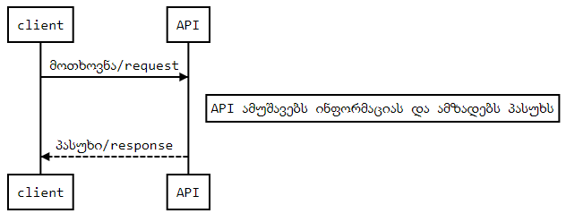

# გავმართოთ Flask-ის მეშვეობით [REST API](https://restfulapi.net/)
ამ ეტაპამდე რამდენჯერმე ვახსენეთ ტერმინი API, შევეხეთ [HTTP მეთოდებს](/Chapter5_Flask#http-მეთოდები) და ავაწყეთ [მარტივი რესურსი](/Chapter5_Flask#საწყისი-აპლიკაციის-შაბლონი) ამ მეთოდებთან სამუშაოდ.
ამ თავში უკეთ გავეცნობით თუ რა არის API, გავეცნობით REST API-ს რესურსებს Flask-ში და ავაწყობთ ჩვენს რესურს Flask-RESTful-ის დახმარებით, რომელსაც წინა თავში შექმნილ რესურსს დავაერთებთ.

## სარჩევი

- [API](#api)
- [რესურსი](#რესურსი)

## API

### რა არის API?

API ანუ **A**pplication **P**rogramming **I**nterface - აპლიკაციის პროგრამული ინტერფეისი არის პროგრამული შეთანხმებების ნაკრები, რომელსაც ორი (ან მეტი) აპლიკაცია იყენებს ერთმანეთთან "ურთიერთობისას". დეველოპერი ქმნის API სერვისს სერვერის მხარეს, რომლის გამოყენებაც მომხმარებელს დისტანციურად შეუძლია.

### რას ნიშნავს REST?

**REST** (Representational State Transfer) განსაზღვრას API-ს სტრუქტურას. ის წარმოადგენს წესების ნაკრებს, რომელსაც დეველოპერი ითვალისწინებს API სერვისის აწყობისას. მაგალითად, ერთ-ერთი ფუნდამენტალური წესია რომ მომხმარებელმა უნდა მიიღოს რაღაც სახის მონაცემი (რესურსი) როდესაც დაუკავშირდები შესაბამის URL-ს. თითოეულ მსგავს კავშირს მოთხოვნა ანუ **request** ეწოდება, ხოლო სერვერის პასუხს **response**. 



### request-ის ანატომია

სტანდარტულად მოთხოვნა შედგება ოთხი ძირითადი შემადგენელი კომპონენტისგან:

1. [the endpoint](#the-endpoint) - დანიშნულების წერტილი
2. [the method](/Chapter5_Flask/Flask.md#http-მეთოდები) - მეთოდი
3. [the headers](#the-headers) - ჰედერები
4. [the data (body)](#the-data-(body)) - შიგთავსი/კონტენტი

#### The Endpoint
**The endpoint** (ანუ route) არის url/მისამართი, მომხმარებლის მოთხოვნის/request საბოლოო დანიშნულების წერტილი. მას აქვს მსგავსი სტრუქტურა:

```bash
root-endpoint/path
```

The **root-endpoint** არის API-ს საწყისი ძირეული მისამართი რომელზეც მოთხოვნები შემოდის. მაგალითად [Github’s API](https://developer.github.com/v3/) ის საწყისი მისამართია `https://api.github.com` ხოლო [Twitter’s API](https://dev.twitter.com/rest/reference)-ის `https://api.twitter.com`.

The **path**  ანუ გზა/მისამართი განსაზღვრავს [რესურსს](#რესურსი) რომელსაც სერვერი იყენებს მოთხოვნის დასამუშავებლად. შესაბამისად ერთი API სერვისი თავის თავში შეიძლება მოიცავდეს რამდენიმე რესურსს, განთავსებულს შესაბამის მისამართზე/path.

მისამართი შეიძლება თავის თავში შეიცავდეს პარამეტრებს რომელსაც რესურსი გამოიყენებს დასამუშავებლად, მაგალითად:

```bash
?query1=value1&query2=value2
```

შესაბამისად პარამეტრების ნაკრებს ყოველთვის იწყებს სიმბოლო `?` და გამოყოფს `&`.

#### The Headers

ჰედერები გამოიყენება როგორც მომხმარებლის ისევე სერვერის მხარეს. ის ინფორმაციის მატარებელი ელემენტია და გამოიყენება მრავალი დანიშნულებით. მაგალითად ავტორიზაციისთვის, ტოკენის გადასატანად, მოთხოვნის შიგთავსის შესახებ ინფორმაციის მისაწოდებლად (მაგ. კონტენტის ტიპზე). HTTP ჰედერების შესახებ მეტი ინფორმაცია ნახედ რეფერენსში - [HTTP Headers Reference](https://developer.mozilla.org/en-US/docs/Web/HTTP/Headers).

**HTTP Headers არის property-value წყვილები** გამოყოფილი ორწერტილით. მაგალითად შემდეგი ჰედერი გვამცნობს რომ კონტენტის ტიპი რომელიც მოთხოვნის შიგთავსშია არის JSON .

```bash
"Content-Type: application/json". 
```

The Data (Body)

The data (შეიძლება შეგხვდეთ როგორც “body” ან “message”) შეიცავს დანიშნულების ადგილზე გადასაცემ ინფორმაციას. ამ პარამეტრს იყენებენ მხოლოდ `POST`, `PUT`, `PATCH` ან `DELETE` ტიპის მოთხოვნებზე.

მოთხონის შიგთავსში შეგვიძლია მოთხონას გავატანოთ ის ძირითადი პარამეტრები, რომლიც გვსურს რომ სერვერის მხარეს დამუშავდეს. ყველაზე გავრცელებული ენა ამ პარამეტრების გადასაცემად არის [JSON](https://restfulapi.net/introduction-to-json/) .

## რესურსი

## რა არის რესურსი? 

რესურსი არის ერთგვარი აბსტრაქციის ფორმა REST-ში. უხეშად რომ ვთქვათ, ნებისმიერი ინფორმაცია რომლის დასახელებაც შეგვიძლია შეიძლება იყოს რესურსი, მაგალითად: დოკუმენტი, სურათი, დროებითი სერვისი ან სხვა რესურსების კოლექცია. 

შესაბამისად ჩვენ შეგვიძლია შევქმნათ მეთოდების ერთბლიობა რომელიც იმუშავებს რესურსთან, მაგალითად განაახლებს რესურსს ან შექმნის მას. ამ მეთოდების ერთობლიობა ქმნის ინტერფეისს, სამუშაო რესურსს ჩვენი API-სთვის.


## [Flask-RESTful](https://flask-restful.readthedocs.io/en/latest/)


**Flask-RESTful** არის Flask ბიბლიოთეკის დამატება, რომელიც უზრუნველყოფს აპლიკაციაში REST APIს მარტივად ჩაშენებას. 

### ინსტალაცია

Flask-RESTful ინსტალაცია `pip`-ის დახმარებით

```
pip install flask-restful
```

development ვერსიის გადმოწერა შესაძლებელლია [GitHub გვერდიდან](https://github.com/flask-restful/flask-restful).

```
git clone https://github.com/flask-restful/flask-restful.git
cd flask-restful
python setup.py develop
```


### მინიმალური Flask აპლიკაცია Flask-RESTful-ით

```python
from flask import Flask
from flask_restful import Resource, Api

app = Flask(__name__)
api = Api(app)

class HelloWorld(Resource):
    def get(self):
        return {'hello': 'world'}

api.add_resource(HelloWorld, '/')

if __name__ == '__main__':
    app.run(debug=True)
```

როგორც ხედავთ API-ს რესურსს ვქმნით როგორც პითონის კლასს. რესურსი თავის თავში აერთიანებს მოთხოვნის მეთოდებს რომელსაც ეს რესურსი ემსახურება.

პირველ რიგში გვესაჭიროება Api და Resource კლასების შემოტანა ბიბლიოთეკიდან. საჭიროა Api  კლასის მიხედვით api ობიექტის შექმნა Flask ობიექტის გამოყენებით. ის დაგვეხმარება Api რესურსების აკინძვაში:

`api = Api(app)`

ამის შემდგომ შეგვიძლია უშუალოდ შევქმნათ რესურსთან სამუშაო კლასი თავისი მეთოდებით:

```python
class ResourceName(Resource):
    def method_name(self): # get, post, put, delete, update
        # some process
        return {'hello': 'world'}
    
        def post(self): # get
        # create the resource
        return {'hello': 'world'}
```

და საბოლოოდ შევქმნათ რესურსისაკენ მარშუტი `add_resource()` მეთოდის გამოყენებით:

```pytho
api.add_resource(ResourceName, '/resource_path')
api.add_resource(HelloWorld,
    '/',
    '/hello')
```


## რესურსის ბაზის მოდელთან ინტეგრირება 

```python
from flask_restful import Resource 
from models.users import UserModel

class Item(Resource):
    def get(self, name):
        item = UserModel.find_by_name(name)
        if item:
            return item.json()
        else:
            return {'message': f' {name} უკვე არის ბაზაში'}, 404
```
